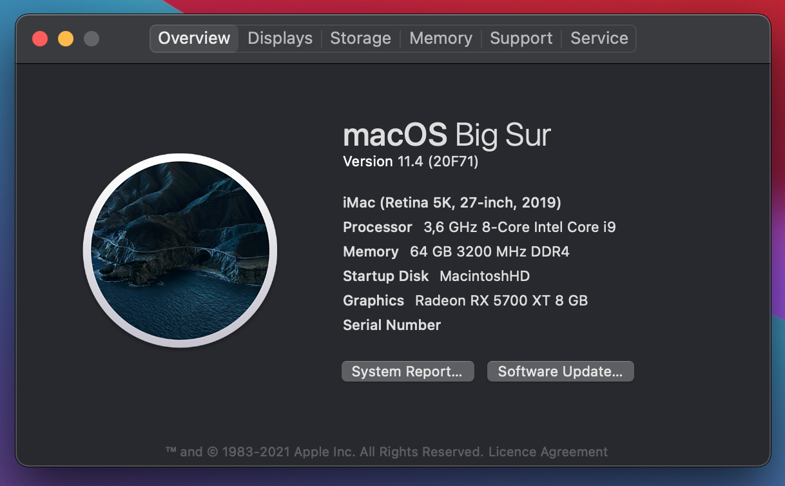

# Hackintosh Big Sure 11.1 guide for Gigabyte Z390 Aorus Master (OpenCore)

This build is "Vanilla" forked from orginal cmer https://github.com/cmer/gigabyte-z390-aorus-master-hackintosh. I used [this guide](https://dortania.github.io/OpenCore-Desktop-Guide/) to build my own OpenCore configuration.

### Hardware

See my [Hardware List](HARDWARE.md)

### What's Working/What's Not

##### Working
- Ethernet (I don't use it)
- Onboard Audio (including digital audio)
- APFS
- Sleep/Wake
- All USB ports at 3.x speed
- iMessage
- App Store
- iCloud
- Facetime
- Handoff
- Bluetooth & Wi-Fi (via Fenvi T919 PCI adapter)
- Airdrop
- AirPlay
- Continuity
- Power Nap
- NVRAM
- Sidecar
- DRMs - DRM isn't supported for Safari 14 and Big Sur via WhateverGreen's DRM patches at this moment but now using `defaults write com.apple.AppleGVA gvaForceAMDKE -boolean yes` that forces AMD DRM decoder for streaming services (like Apple TV and iTunes movie streaming). More details [here] (https://github.com/acidanthera/WhateverGreen/blob/master/Manual/FAQ.Chart.md) 

##### Not Working (as expected)
- Built-in WIFI. There is OpenIntelWireless project but didn't checked it yet https://github.com/OpenIntelWireless/itlwm.
- Onboard Bluetooth. I disabled it (HS14) because I have a natively supported Broadcom BCM94360CD WIFI/BT adapter.

##### Not Yet Tested
- FileVault
- Unlock with Apple Watch

### Step By Step Instructions

This guide is forked from original cmer guide, I followed the [OpenCore Desktop Guide](https://dortania.github.io/OpenCore-Desktop-Guide/) guide to build my own config.plist. When in doubt, just look at my KEXTs, drivers and config.list for guidance.

### USB Port Map & SSDT

See [USB_MAP.md](USB_MAP.md) for a map of all the ports on the Aorus z390 Master.

### My EFI

You are welcome to use my EFI folder. However, make sure you set the following:

- SystemSerialNumber
- SystemUUID
- MLB
